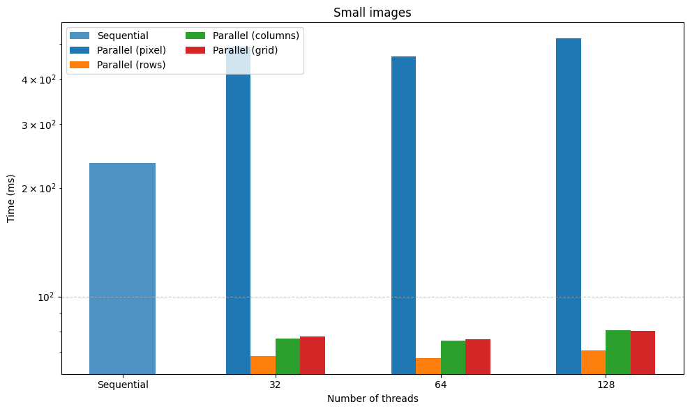
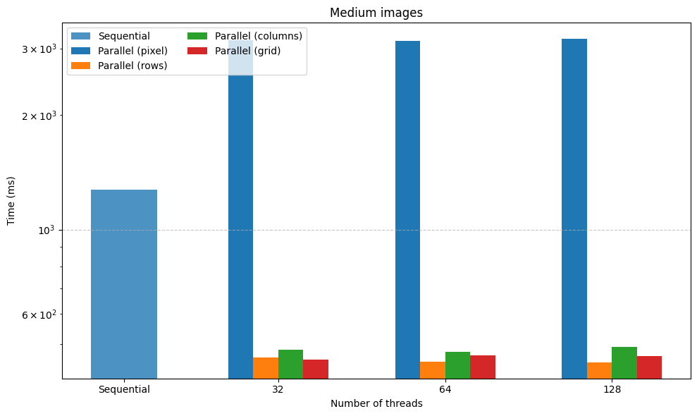
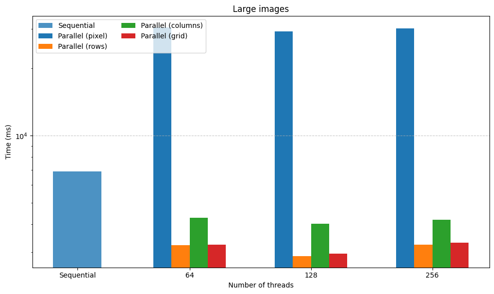

## Image convolution

### Single image convolution

Comparing different implementation of applying filters
on single image

Sequential implementation - each pixel of result
image is computed sequentially

Parallel implementation - different threads are computing
groups of pixels simultaneously using different strategies:

- 1 thread for each pixel _(group = pixel)_
- 1 thread for each row _(group = row of pixels)_
- 1 thread for each column _(group = column of pixels)_
- 1 thread for each arbitrary rectangle grid of image

Maximum number of working threads is limited

Code with benchmark is [here](./src/main/java/Bench1.java)
(`Bench1.java`)

### Stream of images

Comparing different implementation of applying on filter
on many images

Code with benchmark is [here](src/main/java/Bench2.java)
(`Bench2.java`)

